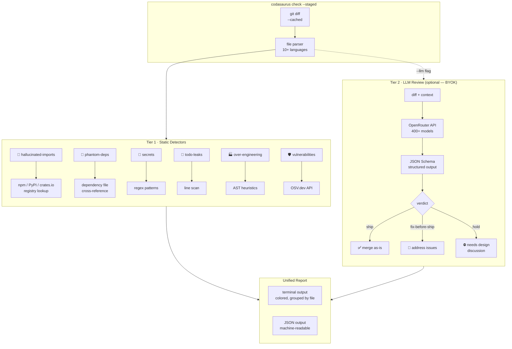
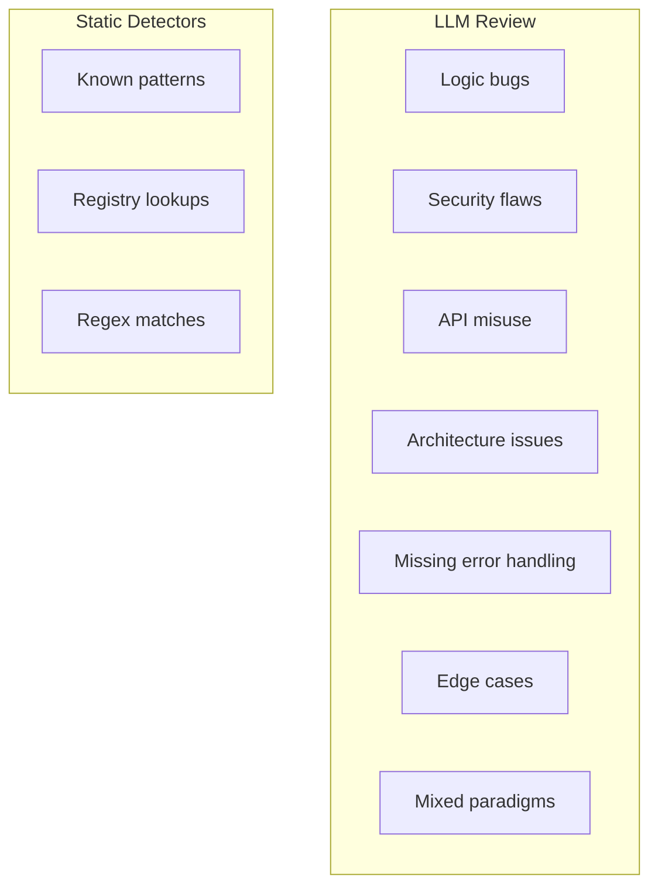
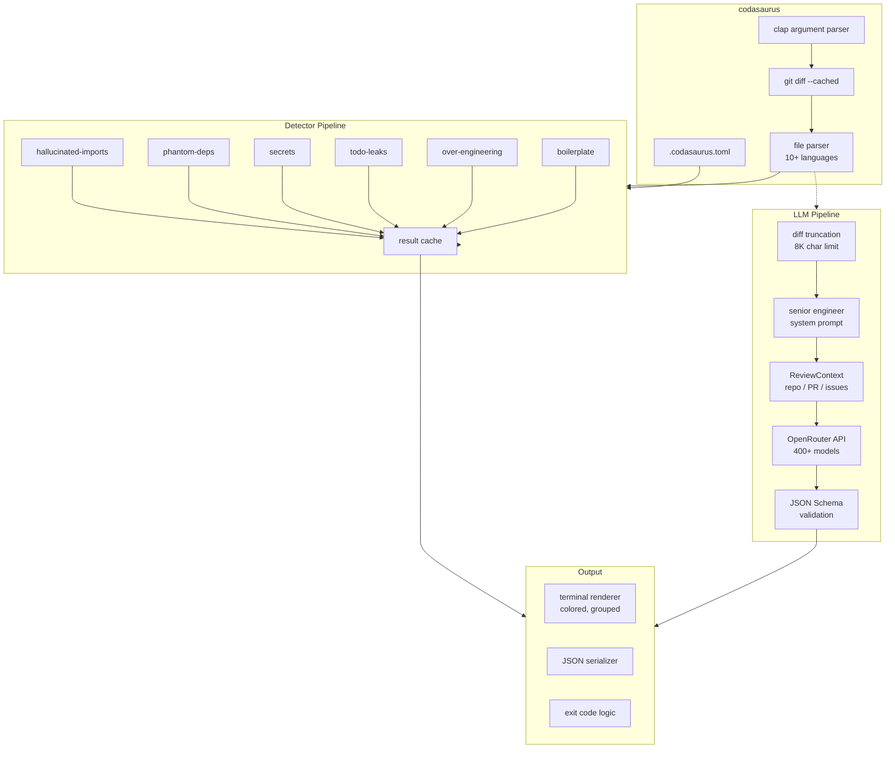

<p align="center">
  
  
  
</p>

<h1 align="center">🦕 Codasaurus</h1>
<p align="center"><b>Munches on AI-generated bugs so you don't have to.</b></p>
<p align="center">
  Catches hallucinated imports, phantom deps, security holes, and over-engineered slop.<br>
  Works locally, in CI, and as a GitHub bot. Bring your own LLM key.
</p>

---

## The Problem

AI coding assistants write code fast. They also:

- **Hallucinate packages** — `import { magicSauce } from 'non-existent-package'`
- **Forget deps** — use lodash but never add it to `package.json`
- **Over-engineer** — factory pattern for 2 variants, 400-line functions
- **Leave TODOs** — `// TODO: implement proper error handling`
- **Leak secrets** — hardcoded API keys, tokens, connection strings
- **Use stale APIs** — trained on old docs, calls deprecated methods

Codasaurus catches all of this **before** it hits your repo.

## Two-Tier Architecture



## What Codasaurus Catches

| Detector | What it catches | How | Cost | False Positives |
|----------|----------------|-----|------|-----------------|
| 🚫 **hallucinated-imports** | Imports that don't exist on npm/PyPI/crates.io | Lives HEAD request to registry API | Free | **Zero** — deterministic |
| 👻 **phantom-deps** | Packages used but not in `package.json`/`Cargo.toml` | Cross-refs imports vs dependency files | Free | **Zero** — deterministic |
| 🔑 **secrets** | API keys, tokens, passwords, JWTs, connection strings | Regex patterns for 15+ credential formats | Free | **~2%** — known patterns only |
| 📝 **todo-leaks** | `TODO`, `FIXME`, `XXX`, `HACK` left by AI | Line scan of staged changes | Free | **Zero** — exact match |
| 🏭 **over-engineering** | Factory pattern for 1-2 variants, unnecessary interfaces | AST heuristics | Free | **~5%** — heuristic-based |
| 📦 **boilerplate** | 200+ line functions, excessive getters, repeated blocks | Pattern matching | Free | **~5%** — heuristic-based |
| 🛡️ **vulnerabilities** | Known package vulnerabilities | OSV.dev API query | Free | **Zero** — database-backed |
| 🤖 **LLM review** | Security flaws, logic bugs, API misuse, architecture | OpenRouter → any LLM model | BYOK | **~5%** — model-dependent |

## Quick Start

```bash
# Install
cargo install codasaurus

# Check staged changes (no setup, no config)
cd my-project
codasaurus check --staged

# CI mode (JSON output, exits non-zero on issues)
codasaurus check --diff origin/main --ci

# With deep LLM review (bring your own key)
export OPENROUTER_API_KEY="sk-or-..."
codasaurus check --staged --llm

# Check a specific file or directory
codasaurus check src/main.rs
```

## Example Output

```diff
🦕 Codasaurus found 5 issue(s):
  3 blocking
  2 warnings

📁 src/app.js

  ✗ [hallucinated-imports]:1
    Package `non-existent-package` not found on npm.
    → This import will crash at runtime. AI coding assistants
      sometimes invent package names that don't exist.
    → Check the correct package name and install it.

  ✗ [secrets]:15
    Potential API Key detected: `sk-live-...abcd`
    → Hardcoded credentials in committed code.
    → Use environment variables and rotate this key.

  ✗ [phantom-deps]:22
    Package `lodash` is used but not declared in package.json.
    → AI added the import but forgot to add the dependency.
    → Run: npm install lodash

  ⚠ [todo-leaks]:8
    Leftover placeholder: "// TODO: implement error handling"

  ⚠ [over-engineering]:30
    Factory pattern detected with only 2 variants — unnecessary
    abstraction for this scope.
```

## Configuration

Create `.codasaurus.toml` in your project root:

```toml
[checks]
hallucinated_imports = true
phantom_deps = true
vulnerabilities = true
secrets = true
over_engineering = true
boilerplate = true
todo_leaks = true

[behavior]
default_severity = "warn"
strict = false
```

## LLM Review (Optional)

Bring your own API key — no per-seat fees. Codasaurus uses OpenRouter, so one key works with 400+ models.

```bash
# Set your API key
export OPENROUTER_API_KEY="sk-or-..."

# Pick a model (optional, defaults to claude-sonnet-4.6)
export CODASAURUS_MODEL="anthropic/claude-sonnet-4.6"
export CODASAURUS_MODEL="google/gemini-3.1-flash-lite"  # cheaper
export CODASAURUS_MODEL="anthropic/claude-opus-4.8"     # best quality

# Run with LLM review
codasaurus check --staged --llm
```

### What the LLM catches that static detectors miss



The LLM provides context-aware analysis:
- *"The app will crash at startup with a module-not-found error"* instead of just *"Package not found"*
- Flags **mixed module systems** (ESM `import` + CJS `require`)
- Detects **missing error handling** around risky operations
- Catches **logical inconsistencies** across multiple changes

## How It's Different

| | CodeRabbit | Greptile | Hawk / Duck | **Codasaurus** |
|---|---|---|---|---|
| **Price** | $24/seat/mo | $15+/seat/mo | Free/BYOK | **Free, open source** |
| **Local checks** | ❌ Cloud only | ❌ Cloud only | Partial | ✅ **Pre-commit + CLI** |
| **AI-specific detectors** | ❌ Generic | ❌ Generic | Some | ✅ **Hallucinated imports, phantom deps** |
| **Multi-language** | JS/TS heavy | Limited | Varies | **10+ languages** |
| **Security (free)** | ✅ Paid tier | ✅ | ❌ | ✅ **OSV.dev + secrets** |
| **LLM review** | ✅ Built-in | ✅ Built-in | ❌ | ✅ **BYOK via OpenRouter** |
| **Deterministic** | Some | ❌ | ❌ | ✅ **Zero false positives on Tier 1** |
| **PR context** | ✅ Linked issues | ❌ | ❌ | ✅ **Linked issues + related PRs** |
| **Install** | SaaS signup | SaaS signup | `npm install` | **`cargo install`** |

## GitHub Action

```yaml
# .github/workflows/codasaurus.yml
name: Codasaurus
on: [pull_request]
jobs:
  review:
    runs-on: ubuntu-latest
    steps:
      - uses: actions/checkout@v4
      - name: Codasaurus Review
        uses: lohitkolluri/codasaurus@v1
        with:
          mode: ci
          diff: origin/main
```

## Development

```bash
# Build release binary
cargo build --release

# Run end-to-end test
mkdir -p /tmp/test && cd /tmp/test && git init
echo 'import { x } from "fake-pkg"' > test.js
codasaurus check --staged

# With LLM
export OPENROUTER_API_KEY="sk-or-..."
codasaurus check --staged --llm
```

## Architecture



## License

MIT

---

<p align="center">
  <sub>Built with 🦕 by <a href="https://github.com/lohitkolluri">Lohit Kolluri</a></sub>
</p>
