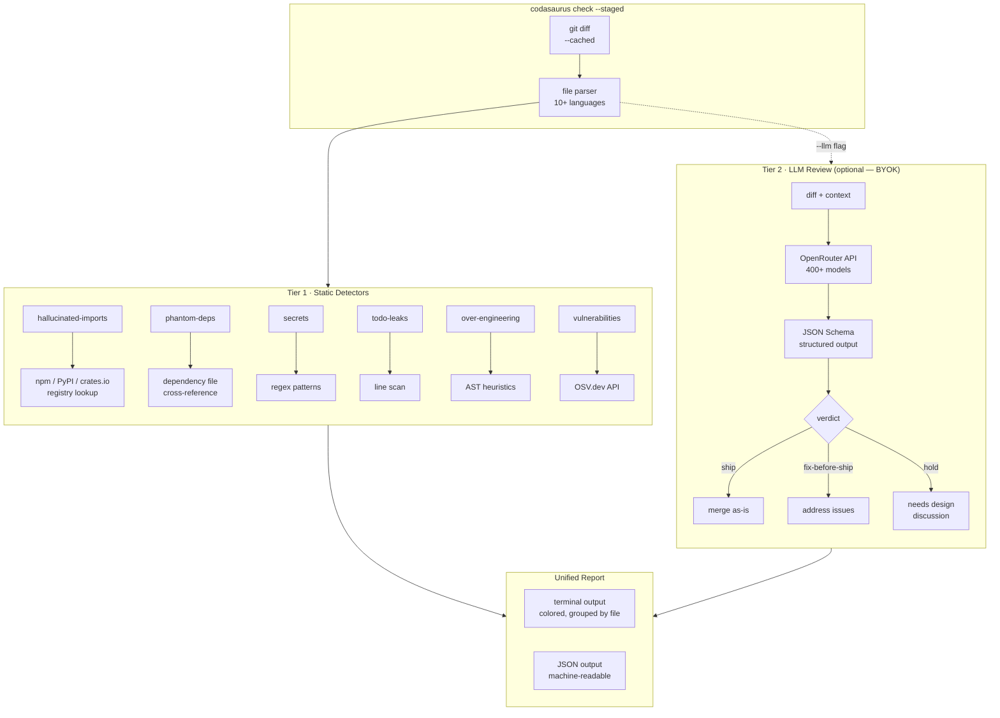
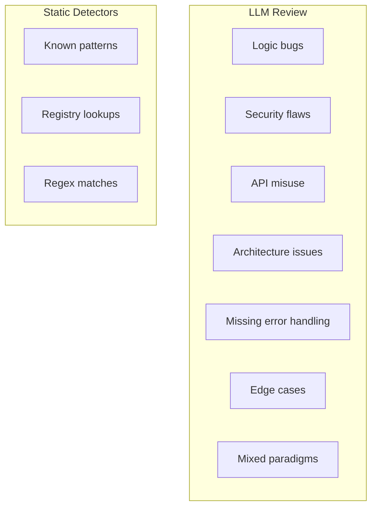
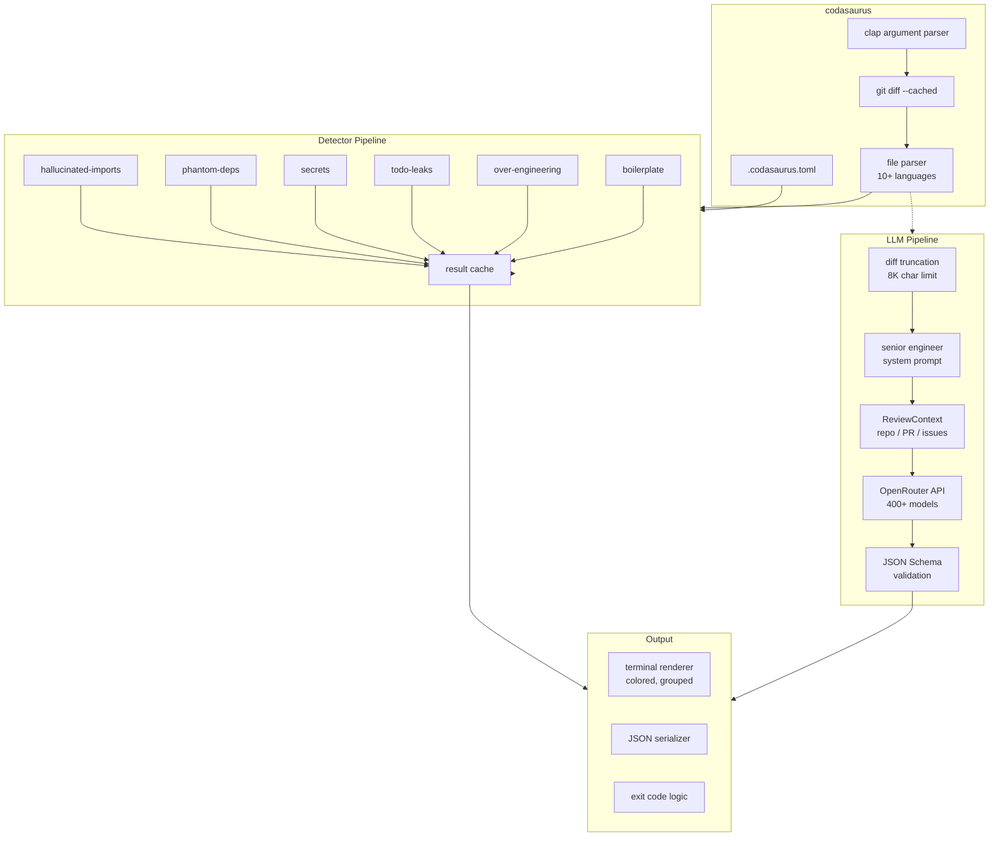

<p align="center">
  <a href="https://github.com/lohitkolluri/codasaurus/actions/workflows/ci.yml"></a>
  
  
  
</p>

<p align="center">
  
</p>

<h1 align="center">Codasaurus</h1>
<p align="center"><b>Static and AI-powered code review for AI-generated changes.</b></p>
<p align="center">
  Detects hallucinated imports, undeclared dependencies, leaked secrets, and vulnerable packages<br>
  before they reach your repository — locally, in CI, or as a GitHub Action.
</p>

---

## Why Codasaurus

AI assistants write fast, and they make the same mistakes every time. The model reaches for a package it half-remembers, wires up an API it last saw in 2022, or leaves a hardcoded key in the diff. None of it surfaces until something breaks in production.

Codasaurus checks your staged or diffed changes before they land:

- **Hallucinated imports** — packages that don't exist on npm, PyPI, or crates.io
- **Undeclared dependencies** — a library used but missing from the manifest
- **Leaked secrets** — API keys, tokens, connection strings
- **Stale APIs** — calls against deprecated or outdated signatures
- **Over-engineering** — abstraction that isn't warranted by the scope
- **Leftover markers** — `TODO`, `FIXME`, `XXX` committed to the tree

Static checks are deterministic. Add `--llm` with your own OpenRouter key and it also reviews for logic and security issues the patterns can't see.

## Features

- **Deterministic by default.** Registry lookups, dependency cross-referencing, and pattern matching — zero false positives on Tier 1.
- **Optional LLM review.** Bring your own OpenRouter key; works with 400+ models, no per-seat fee.
- **10+ languages** parsed out of the box.
- **CI-ready.** JSON output and non-zero exit on blocking issues.
- **Local-first.** Static checks need no account and no cloud.
- **Self-hosted GitHub Action.** Runs as a composite action inside your own workflows.

## Architecture

Codasaurus runs in two tiers. Tier 1 is fully static and deterministic; Tier 2 is an optional LLM pass.



## Detectors

| Detector | Catches | Method | Cost | False Positives |
|----------|---------|--------|------|-----------------|
| **hallucinated-imports** | Imports absent from npm/PyPI/crates.io | Live HEAD request to registry API | Free | **Zero** — deterministic |
| **phantom-deps** | Packages used but missing from the manifest | Cross-references imports vs dependency files | Free | **Zero** — deterministic |
| **secrets** | API keys, tokens, passwords, JWTs, connection strings | Regex for 15+ credential formats | Free | **~2%** — known patterns only |
| **todo-leaks** | `TODO`, `FIXME`, `XXX`, `HACK` in changes | Line scan of staged diff | Free | **Zero** — exact match |
| **over-engineering** | Factory patterns for 1–2 variants, unnecessary interfaces | AST heuristics | Free | **~5%** — heuristic |
| **boilerplate** | 200+ line functions, repeated blocks | Pattern matching | Free | **~5%** — heuristic |
| **vulnerabilities** | Known package vulnerabilities | OSV.dev API query | Free | **Zero** — database-backed |
| **stale-api** | Deprecated methods and outdated API patterns | Pattern matching against known migrations | Free | **~5%** — heuristic |
| **graph** | Dead code and unused exports via call-graph analysis | Builds a code graph, checks reachability | Free | **~5%** — heuristic |
| **guidelines** | Branch naming, commit conventions, DCO sign-off, required files | Parses `CONTRIBUTING`/guidelines into checkable rules | Free | **Zero** — exact match |
| **LLM review** | Security flaws, logic bugs, API misuse | OpenRouter → any model | BYOK | **~5%** — model-dependent |

## Quick Start

```bash
# Install
cargo install codasaurus

# Check staged changes (no setup, no config)
cd my-project
codasaurus check --staged

# CI mode (JSON output, exits non-zero on issues)
codasaurus check --diff origin/main --ci

# Deep LLM review (bring your own key)
export OPENROUTER_API_KEY="sk-or-..."
codasaurus check --staged --llm

# Check a specific file or directory
codasaurus check src/main.rs
```

## Example Output

```text
  🦕 Codasaurus — 3 blocking, 2 warnings

  src/app.js
    ✗ hallucinated-imports [:1]
      Package `non-existent-package` not found on npm.
      → Check the correct package name and install it.

    ✗ secrets [:15]
      Potential API key detected: `sk-live-...abcd`
      → Move the credential to an environment variable and rotate the key.

    ✗ phantom-deps [:22]
      Package `lodash` is used but not declared in package.json.
      → Run: npm install lodash

  src/utils.ts
    ⚠ todo-leaks [:8]
      Leftover placeholder: "// TODO: implement error handling"

    ⚠ over-engineering [:30]
      Factory pattern detected with only 2 variants — unnecessary abstraction for this scope.
```

Severity is `✗` blocking, `⚠` warning, and `ℹ` info. Each finding shows the detector, the location, the message, and a suggested fix. JSON output (`--json`) emits the same findings as machine-readable records for CI.

## Configuration

Create `.codasaurus.toml` in your project root:

```toml
[checks]
hallucinated_imports = true
phantom_deps = true
vulnerabilities = true
secrets = true
over_engineering = true
boilerplate = true
todo_leaks = true

[behavior]
default_severity = "warn"
strict = false
```

## LLM Review (Optional)

Bring your own API key — no per-seat fees. Codasaurus uses OpenRouter, so one key works with 400+ models.

```bash
# Set your API key
export OPENROUTER_API_KEY="sk-or-..."

# Pick a model (optional, defaults to qwen/qwen3-coder:free — zero cost)
export CODASAURUS_MODEL="qwen/qwen3-coder:free"                     # Default (free)
export CODASAURUS_MODEL="meta-llama/llama-3.3-70b-instruct:free"    # Strong free model
export CODASAURUS_MODEL="anthropic/claude-sonnet-4.6"               # Paid

# Or use a self-hosted OpenAI-compatible server — no API key is required
# when the server does not require authentication.
export CODASAURUS_BASE_URL="http://localhost:11434/v1"              # Ollama / vLLM / LocalAI
export CODASAURUS_MODEL="qwen2.5-coder:7b"

# Run with LLM review
codasaurus check --staged --llm
```

### What LLM review adds

The LLM pass provides context-aware analysis that static detectors cannot:

- Explains *why* a change fails — e.g. *"The app will crash at startup with a module-not-found error"* rather than *"Package not found"*
- Flags **mixed module systems** (ESM `import` + CJS `require`)
- Detects **missing error handling** around risky operations
- Catches **logical inconsistencies** across multiple changes



## Comparison

| | CodeRabbit | Greptile | Hawk / Duck | **Codasaurus** |
|---|---|---|---|---|
| **Price** | $24/seat/mo | $15+/seat/mo | Free/BYOK | **Free, open source** |
| **Local checks** | Cloud only | Cloud only | Partial | **Pre-commit + CLI** |
| **AI-specific detectors** | Generic | Generic | Some | **Hallucinated imports, phantom deps** |
| **Multi-language** | JS/TS heavy | Limited | Varies | **10+ languages** |
| **Security (free)** | Paid tier | Yes | No | **OSV.dev + secrets** |
| **LLM review** | Built-in | Built-in | No | **BYOK via OpenRouter** |
| **Deterministic** | Partial | No | No | **Zero false positives on Tier 1** |
| **PR context** | Linked issues | No | No | **Linked issues + related PRs** |
| **Install** | SaaS signup | SaaS signup | `npm install` | **`cargo install`** |

## CI Integration

The repository ships with a [CI workflow](.github/workflows/ci.yml) that runs format check, clippy, tests, release build, and a **self-review** — Codasaurus checks itself on every push:

```yaml
# .github/workflows/ci.yml (check, test, build, and self-review)
codasaurus-self:
  steps:
    - uses: actions/checkout@v4
    - name: Download built binary
      uses: actions/download-artifact@v4
      with:
        name: codasaurus
    - name: Make executable
      run: chmod +x codasaurus
    - name: Run self-review
      run: ./codasaurus check --diff origin/main --ci
```

For your own projects, use the check command directly:

```yaml
- name: Codasaurus Review
  uses: lohitkolluri/codasaurus@v1
```

## Development

```bash
# Build release binary
cargo build --release

# Run end-to-end test
mkdir -p /tmp/test && cd /tmp/test && git init
echo 'import { x } from "fake-pkg"' > test.js
codasaurus check --staged

# With LLM
export OPENROUTER_API_KEY="sk-or-..."
codasaurus check --staged --llm
```

## Architecture Detail



## License

MIT — see [LICENSE](LICENSE).

---

<p align="center">
  <sub>Maintained by <a href="https://github.com/lohitkolluri">Lohit Kolluri</a></sub>
</p>
