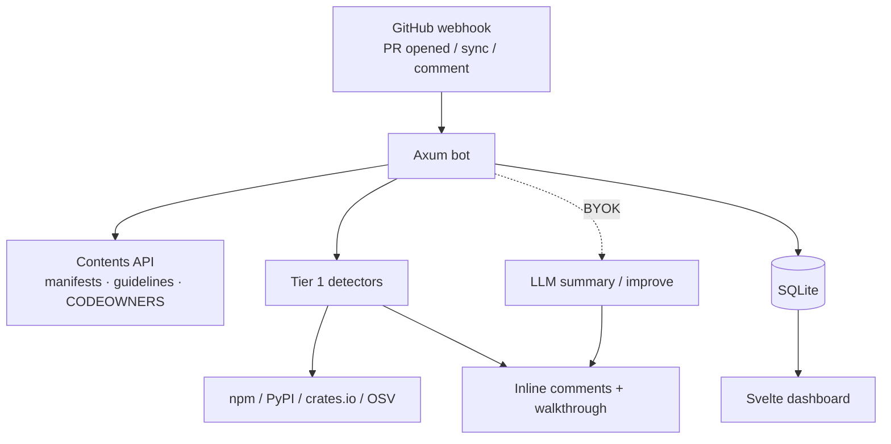

<p align="center">
  <a href="https://github.com/lohitkolluri/codasaurus/actions/workflows/ci.yml"></a>
  
  
  
</p>

<p align="center">
  
</p>

<h1 align="center">Codasaurus</h1>
<p align="center"><b>Self-hosted GitHub App PR review agent.</b></p>
<p align="center">
  Tier-1 static detectors + optional BYOK LLM — walkthroughs, inline comments,<br>
  <code>@codasaurus</code> commands, learning from dismissals, and a Svelte control plane.
</p>

---

## Why Codasaurus

AI assistants write fast, and they make the same mistakes every time. The model reaches for a package it half-remembers, wires up an API it last saw in 2022, or leaves a hardcoded key in the diff.

Codasaurus is a **single Rust binary** you self-host as a GitHub App. On every PR it runs deterministic detectors and optionally a BYOK LLM pass — no per-seat tax.

- **Hallucinated imports** — packages that don't exist on npm, PyPI, or crates.io
- **Undeclared dependencies** — used but missing from the manifest
- **Leaked secrets** — API keys, tokens, connection strings
- **Vulnerable packages** — OSV.dev lookups
- **Stale APIs / AI slop** — deprecated patterns, TODO leaks, over-engineering
- **Guidelines** — branch / DCO / conventional commits from remote `CONTRIBUTING`
- **Walkthrough + slash commands** — `@codasaurus review|describe|improve|ask|ignore|help`

## Features

- **GitHub App first.** Webhooks → review comments, walkthroughs, CODEOWNERS hints.
- **Deterministic Tier 1.** Registry lookups and pattern matching — no LLM required.
- **BYOK LLM.** OpenRouter or Ollama / any OpenAI-compatible endpoint.
- **Learning.** Dismissals and fingerprints suppress noise across reviews.
- **Self-hosted.** Docker Compose + SQLite; dashboard for repos, reviews, settings.
- **One binary.** `codasaurus serve` (+ `health` / `version`).

## Architecture



## Detectors

| Detector                           | Catches                                | Method                   |
| ---------------------------------- | -------------------------------------- | ------------------------ |
| **hallucinated-imports**           | Imports absent from registries         | Live registry HEAD       |
| **phantom-deps**                   | Used but undeclared packages           | Manifest cross-reference |
| **secrets**                        | Keys, tokens, JWTs, connection strings | Regex (15+ formats)      |
| **vulnerabilities**                | Known CVEs in deps                     | OSV.dev                  |
| **todo-leaks / slop**              | `TODO`/`FIXME`, AI markers             | Line scan                |
| **over-engineering / boilerplate** | Unnecessary abstraction                | AST heuristics           |
| **stale-api**                      | Deprecated API patterns                | Migration patterns       |
| **graph**                          | Dead code / unused exports             | Call-graph reachability  |
| **guidelines**                     | Branch, DCO, conventional commits      | Remote CONTRIBUTING      |
| **LLM review**                     | Logic / security / API misuse          | OpenRouter or local      |

## Quick Start

```bash
# Clone and run
git clone https://github.com/lohitkolluri/codasaurus.git
cd codasaurus
docker compose up

# Or build locally
cargo build --release
export DATABASE_URL="sqlite://./codasaurus.db?mode=rwc"
./target/release/codasaurus serve --port 3000
```

Open the dashboard, complete setup, install the GitHub App on your repos. See [docs/github-app-setup.md](docs/github-app-setup.md).

Binary commands:

```bash
codasaurus serve [--host 0.0.0.0] [--port 3000]
codasaurus health [--host localhost] [--port 3000]
codasaurus version
```

## Slash commands

On any PR comment:

| Command                | Effect                                             |
| ---------------------- | -------------------------------------------------- |
| `@codasaurus review`   | Full Tier-1 (+ optional LLM summary)               |
| `@codasaurus describe` | Walkthrough / PR description                       |
| `@codasaurus improve`  | LLM review_diff suggestions (falls back to static) |
| `@codasaurus ask …`    | Question about the PR                              |
| `@codasaurus ignore`   | Suppress fingerprint / learning                    |
| `@codasaurus help`     | Command list                                       |

## LLM (optional)

```bash
export OPENROUTER_API_KEY="sk-or-..."
# or local
export CODASAURUS_BASE_URL="http://localhost:11434/v1"
export CODASAURUS_MODEL="qwen2.5-coder:7b"
```

Enable LLM in the dashboard per installation / repo settings.

## Comparison

|                           | CodeRabbit | Greptile           | PR-Agent         | **Codasaurus**                         |
| ------------------------- | ---------- | ------------------ | ---------------- | -------------------------------------- |
| **Price**                 | Seat SaaS  | Seat SaaS          | OSS + commercial | **Free, self-host**                    |
| **Deploy**                | Cloud      | Cloud / enterprise | Your infra       | **One Docker binary**                  |
| **AI-specific detectors** | Generic    | RAG-heavy          | Generic          | **Hallucinated imports, phantom deps** |
| **Secrets / OSV**         | Paid tiers | Varies             | Limited          | **Built into Tier 1**                  |
| **LLM**                   | Bundled    | Bundled            | BYOK / vendor    | **BYOK OpenRouter / Ollama**           |
| **Learning**              | Yes        | Yes                | Rules / RAG      | **Dismiss fingerprints**               |

Roadmap (“Excalibur”): auto-describe, severity budgets, Check Runs, durable queue, Postgres HA — see `.cursor/plans/excalibur-pr-agent.md`.

## Configuration

Repo-level overlay via dashboard / `config_json`, plus optional `.codasaurus.toml` fields mirrored into bot config:

```toml
[checks]
hallucinated_imports = true
phantom_deps = true
vulnerabilities = true
secrets = true
over_engineering = true
boilerplate = true
todo_leaks = true
```

## Development

```bash
cargo fmt --check
cargo clippy -- -D warnings
CODASAURUS_SKIP_FRONTEND_BUILD=1 cargo test
cargo build --release
```

## License

MIT — see [LICENSE](LICENSE).

---

<p align="center">
  <sub>Maintained by <a href="https://github.com/lohitkolluri">Lohit Kolluri</a></sub>
</p>
