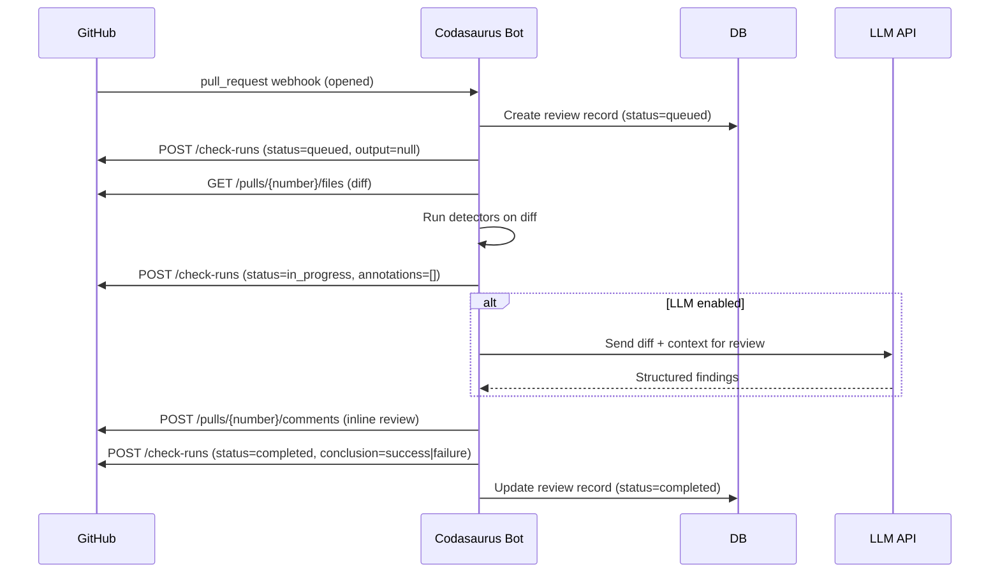

# Codasaurus — Self-Hostable AI Code Review Platform

**Date:** 2026-07-19
**Status:** Draft
**Author:** Lohit Kolluri

## Executive Summary

Codasaurus becomes the first **completely self-hostable, open-source AI code review platform** competitive with CodeRabbit and CodeAnt AI. No other tool in this space offers self-hosting without a per-seat enterprise license. This spec covers the full platform architecture and phased delivery over 180 days.

**Market wedge:** "Self-hostable AI code review — no code leaves your infrastructure."

---

## Architecture

### Deployment Model

Single binary serving all roles:

```
┌─────────────────────────────────────────────┐
│              codasaurus binary               │
│                                              │
│  ┌──────────┐ ┌──────────┐ ┌──────────────┐ │
│  │  CLI     │ │  Webhook │ │  Web Dashboard│ │
│  │  (check, │ │  Server  │ │  (axum +      │ │
│  │  verify, │ │  (axum)   │  │   Svelte SPA) │ │
│  │  serve)  │ │          │ │              │ │
│  └──────────┘ └──────────┘ └──────────────┘ │
│                                              │
│  ┌──────────────────────────────────────────┐│
│  │         SQLite (rusqlite)                ││
│  │   repos, reviews, findings, users,       ││
│  │   feedback, settings, audit_log          ││
│  └──────────────────────────────────────────┘│
│                                              │
│  ┌──────────────────────────────────────────┐│
│  │   LLM Client (OpenRouter / Ollama /       ││
│  │   any OpenAI-compatible endpoint)         ││
│  └──────────────────────────────────────────┘│
└─────────────────────────────────────────────┘
```

**Key decisions:**
- **Dual-backend: SQLite (default) + Postgres (production)** — at startup, the binary checks for `DATABASE_URL`. If absent, it opens `codasaurus.db` with SQLite in WAL mode (zero-config, works immediately). If `DATABASE_URL` is set (e.g. `postgres://user@db.neon.tech/codasaurus`), it connects via `sqlx` with async connection pooling. Both backends use the same migration files via `sqlx::migrate!()` — dialect differences handled with conditional queries. SQLite covers personal/small-team use; Postgres via Neon/Supabase scales to multi-repo orgs.
- **BYOK LLM with Ollama companion** — the binary talks to any OpenAI-compatible API. Users who want fully local inference deploy Ollama alongside in docker-compose. Docs provide a `docker-compose.ollama.yml` overlay.
- **Embedded web dashboard** — Svelte SPA compiled to static files, embedded via `rust-embed`, served by axum. Requires a Node.js build step at compile time (not at runtime). The SPA talks to the axum JSON REST API.
- **Design system: Monochrome, Tesla/SpaceX minimal** — no colors except black, white, gray, and semantic red/green used very sparingly for blocking findings and passes. Thin borders, no border-radius, no shadows, generous whitespace. System font stack (Inter). The UI communicates through typography and layout hierarchy, not color or decoration.

### Domain & HTTPS

A self-hosted GitHub App requires a public HTTPS URL. Webhook delivery, OAuth callbacks, and "View in Codasaurus" links all need a reachable domain.

**Default path: DuckDNS + Caddy** — zero-cost, auto-renewing Let's Encrypt, production-grade.

- [DuckDNS](https://duckdns.org): free dynamic DNS, pick `yourname.duckdns.org` once, never expires
- [Caddy](https://caddyserver.com): auto-provisions Let's Encrypt TLS, single-line reverse proxy config
- DuckDNS update script runs as a sidecar container to keep the A record synced with the server's public IP

**Alternative: Cloudflare Tunnel** — no public IP needed, Cloudflare terminates TLS, traffic never hits your origin. Slightly more setup but better for home servers behind CGNAT.

### Docker Deployment

```yaml
# docker-compose.yml
services:
  caddy:
    image: caddy:latest
    ports:
      - "80:80"
      - "443:443"
    volumes:
      - ./Caddyfile:/etc/caddy/Caddyfile
      - caddy_data:/data
    depends_on:
      - codasaurus
    restart: unless-stopped

  codasaurus:
    image: ghcr.io/lohitkolluri/codasaurus:latest
    ports:
      - "8080:8080"
    volumes:
      - codasaurus_data:/data          # SQLite DB
      - ./codasaurus.yml:/etc/codasaurus.yml  # config
    environment:
      CODASAURUS_GITHUB_APP_ID: ""
      CODASAURUS_GITHUB_APP_PRIVATE_KEY: ""
      CODASAURUS_GITHUB_APP_WEBHOOK_SECRET: ""
      CODASAURUS_OPENROUTER_API_KEY: ""       # or LLM_ENDPOINT + LLM_API_KEY
      CODASAURUS_HOST: "0.0.0.0"
      CODASAURUS_PORT: "8080"
      CODASAURUS_DATA_DIR: "/data"
    restart: unless-stopped

volumes:
  codasaurus_data:
```

---

## Phase 1: Web Dashboard + Setup Wizard (Weeks 1-3)

### What ships

A Svelte SPA web dashboard and first-run setup wizard, all compiled into the same binary. The dashboard is the face of the platform — the PR bot (Phase 2) posts to a UI that already exists.

**First-run setup wizard** guides users through:
1. Database config (SQLite default or Postgres URL with test connection)
2. LLM config (OpenRouter / Ollama / Custom endpoint with test button)
3. GitHub App creation (one-click manifest or paste credentials)
4. Admin user creation (email + password)

**Dashboard pages:**

| Route | Purpose |
|---|---|
| `/` | Setup wizard (redirects if no admin user) |
| `/login` | Admin login |
| `/app/dashboard` | Overview — stats, recent reviews, repo health |
| `/app/repos` | Connected repos, install new ones |
| `/app/repos/:id` | Per-repo settings — detector toggles, LLM config |
| `/app/reviews` | Recent reviews, filterable by repo/status/severity |
| `/app/reviews/:id` | Review detail — file tree + findings grouped by line |
| `/app/settings` | Global settings — LLM, detectors, notifications |
| `/app/settings/github` | GitHub App reconfiguration / reinstall |
| `/app/audit` | Event history — installs, reviews, config changes |

**Design system: Monochrome (Tesla/SpaceX minimal).** See `.omo/plans/phase1-dashboard-setup-wizard.md` for full design tokens.

### New Dependencies

```toml
# Rust
sqlx = { version = "0.8", features = ["runtime-tokio", "sqlite", "postgres", "migrate"] }
rust-embed = "8"
tower-sessions = "0.13"
argon2 = "0.5"
uuid = { version = "1", features = ["v4"] }

# Svelte (dev only, built at compile time)
# svelte ^5, vite ^6, @sveltejs/vite-plugin-svelte ^5
```

### New/Modified Files

| File | Change |
|---|---|
| `svelte-dashboard/` | **New** — Svelte SPA project (pages, components, stores, config) |
| `src/db/mod.rs` | **New** — sqlx pool creation, dual-backend (SQLite + Postgres), migration runner |
| `src/db/migrations.rs` | **New** — embedded SQL migrations |
| `src/db/models.rs` | **New** — Rust structs for all tables |
| `src/db/repos.rs` | **New** — Repo CRUD |
| `src/db/reviews.rs` | **New** — Review + Finding CRUD |
| `src/db/audit.rs` | **New** — Audit log |
| `src/db/config.rs` | **New** — App config key-value store |
| `src/db/users.rs` | **New** — User CRUD + auth |
| `src/api/mod.rs` | **New** — API router construction |
| `src/api/setup.rs` | **New** — Setup wizard endpoints |
| `src/api/auth.rs` | **New** — Login/logout, sessions |
| `src/api/stats.rs` | **New** — Dashboard stats |
| `src/api/repos.rs` | **New** — Repo CRUD endpoints |
| `src/api/reviews.rs` | **New** — Review listing + detail |
| `src/api/settings.rs` | **New** — Settings CRUD |
| `src/api/audit.rs` | **New** — Audit log querying |
| `src/api/middleware.rs` | **New** — Auth middleware |
| `src/bot/mod.rs` | **Update** — merge API routes + SPA serving into existing `serve()` |
| `src/lib.rs` | **Update** — add `pub mod db;`, `pub mod api;` |
| `Cargo.toml` | **Update** — add sqlx, rust-embed, tower-sessions, argon2, uuid |
| `build.rs` | **New** — optional Svelte build step in cargo build |
| `Dockerfile` | **Update** — multi-stage build for Svelte + Rust |

### Implementation Plan

Detailed break down in `.omo/plans/phase1-dashboard-setup-wizard.md`.

---

## Phase 2: PR Review Bot v2 (Weeks 4-6)

### What ships

A GitHub App that:
1. Listens to `pull_request` webhooks (opened, reopened, synchronize, ready_for_review)
2. Runs the existing `check` detectors + optional LLM review on the diff
3. Posts **Check Run** with annotations grouped by file
4. Posts **inline review comments** on specific diff lines
5. Updates Check Run status as analysis progresses (queued → in_progress → completed)
6. Supports `@codasaurus review` and `@codasaurus ignore` comment commands

### Architecture for PR Review



### New/Modified Files

| File | Change |
|---|---|
| `src/bot/review.rs` | Rewrite: pull diff → run checks → post Check Runs + inline comments, store findings to DB |
| `src/bot/mod.rs` | Add webhook event routing for pull_request, issue_comment (existing handler updated to use new DB and Check Runs API) |
| `src/db/reviews.rs` | Add review CRUD methods needed by the bot |

### Check Run API Integration

The bot uses GitHub's [Checks API](https://docs.github.com/en/rest/checks/runs) to post status and [annotations](https://docs.github.com/en/rest/checks/runs#create-a-check-run) grouped by file:

```
POST /repos/{owner}/{repo}/check-runs
{
  "name": "codasaurus",
  "head_sha": "abc123...",
  "status": "in_progress" | "completed",
  "conclusion": "success" | "failure" | "neutral",
  "output": {
    "title": "Codasaurus — 3 blocking, 2 warnings",
    "summary": "### Detectors Run\n- hallucinated-imports: 1 finding\n- secrets: 1 finding\n...",
    "annotations": [
      {
        "path": "src/app.js",
        "start_line": 1,
        "end_line": 1,
        "annotation_level": "failure",
        "message": "Package `non-existent-package` not found on npm.",
        "title": "hallucinated-imports"
      }
    ]
  }
}
```

**Lifecycle:**
1. On webhook receipt → POST with `status: "queued"`, no output (GitHub shows "pending" in UI)
2. After detectors finish → POST with `status: "completed"`, full annotations
3. Fallback: if the Check Run request fails (GitHub App lacks checks:write permission), fall back to PR comments via issue comments

### Inline Review Comments

For actionable findings with exact line numbers, the bot also posts inline review comments:

```
POST /repos/{owner}/{repo}/pulls/{number}/reviews
{
  "commit_id": "abc123...",
  "event": "COMMENT",
  "comments": [
    {
      "path": "src/app.js",
      "position": 5,
      "body": "**Codasaurus: hallucinated-imports** ✗\n\nPackage `non-existent-package` not found on npm.\n\n→ Check the correct package name and install it."
    }
  ]
}
```

### Comment Commands

| Command | Action |
|---|---|
| `@codasaurus review` | Trigger a new review on current head |
| `@codasaurus full review` | Review including LLM pass (even if LLM not default) |
| `@codasaurus ignore` | Dismiss all findings (adds reason context) |
| `@codasaurus thumbs-up <fingerprint>` | Mark a finding as accurate |
| `@codasaurus thumbs-down <fingerprint>` | Mark a finding as a false positive |

### Error Handling

| Scenario | Behavior |
|---|---|
| GitHub API rate limit (secondary) | Retry with exponential backoff (32s → 64s → 128s, max 3 retries) |
| Detector panic | Catch per-detector, log, continue with remaining detectors |
| LLM API timeout | Skip LLM pass, report in Check Run summary that LLM was skipped |
| Webhook signature mismatch | Return 401, log warning |
| Binary crash during review | Next webhook event for the same PR finds existing review, resumes or restarts based on staleness |

---

## Phase 3: Feedback Learning Loop (Weeks 7-8)

### What ships

After Phase 2, the bot posts findings to both GitHub (Check Runs + inline comments) and the dashboard DB. Phase 3 closes the quality feedback loop:

1. **Thumbs up/down on findings** — via comment command (`@codasaurus thumbs-up <fingerprint>`) or dashboard UI
2. **Dismissal patterns → rule tuning** — if the same detector fires on the same package/pattern and gets dismissed 3+ times, auto-silence with stored reason
3. **Accuracy dashboard** — precision per detector, most-dismissed patterns, top false-positive sources

### Feedback Flow

```
Finding shows on PR → User dismisses (with reason)
                     → User thumbs-down (false positive)
                     → recorded in feedback_log

After N dismissals of same detector+pattern → 
    config override created (detector.pattern.severity = "off" | "warning")
```

Rule-based pattern suppression. ~200 lines of SQL + config writes.

---

## Phase 4: MCP Server (Week 9)

### What ships

An MCP server that exposes the verify command as a tool for AI coding agents (Cursor, Claude Code, Cline):

```json
{
  "tools": [
    {
      "name": "codasaurus_verify",
      "description": "Verify a code change for AI-generated issues",
      "inputSchema": {
        "type": "object",
        "properties": {
          "path": { "type": "string" },
          "diff": { "type": "string" }
        }
      }
    }
  ]
}
```

The MCP server runs as a sidecar alongside the main binary (`codasaurus mcp` subcommand), sharing the same SQLite DB.

---

## Phase 5: Enterprise Package (Weeks 10-18)

### What ships

- **SOC 2 Type II readiness package** — audit log, access controls, data retention policies, documentation
- **SSO/SCIM** — OpenID Connect + SAML support via `openidconnect` crate or Dex sidecar
- **RBAC** — admin, reviewer, viewer roles
- **Data retention** — configurable TTL for findings, reviews, audit logs
- **Read-only replica** — second SQLite instance that replays via WAL shipping (optional)

---

## Documentation & Onboarding

### Quickstart (for README)

```bash
# 1. Deploy with Docker
docker run -d -p 3000:3000 ghcr.io/lohitkolluri/codasaurus:latest

# 2. Open http://localhost:3000 — the setup wizard guides you through:
#    - Database (SQLite default, or Postgres URL)
#    - LLM config (OpenRouter / Ollama / custom)
#    - GitHub App (one-click manifest or paste credentials)
#    - Admin account

# 3. Install the GitHub App on your repos from the dashboard
# 4. Open a PR — Codasaurus reviews it automatically
```

### Deployment Options

| Method | Complexity | Best for |
|---|---|---|
| `docker run` | Minimal | Single-repo / personal |
| `docker-compose` | Low | Team with persistent data |
| Kubernetes + Helm chart | Medium | Multi-repo / org-wide |
| Bare metal / systemd | Medium | Air-gapped / compliance-heavy |
| Ollama overlay | Low | Fully offline (add `docker-compose.ollama.yml`) |

---

## Non-Goals

- **Multi-cloud / sharded SQLite** — not needed for self-hosted scale. Migrate to Postgres in a future phase if necessary.
- **Native mobile app** — mobile-responsive web dashboard is sufficient.
- **Bitbucket / GitLab / Azure DevOps** — GitHub-only in v1. GitLab follows once GitHub is solid.
- **On-prem model training** — rule-based pattern suppression only. No ML training pipeline.
- **VS Code extension** — Phase 2 at earliest. The PR bot + MCP server cover the IDE integration surface for now.

---

## Open Questions

1. **Docker registry?** ghcr.io (existing) or also Docker Hub?
2. **GitLab support prioritization?** Several self-hosted teams use GitLab self-hosted — should GitLab MR bot follow immediately after GitHub, or wait until after the dashboard ships?

---

## Success Criteria

### Phase 1 (Dashboard + Setup Wizard)
1. `docker run` → open browser → setup wizard guides through full config in ≤5 minutes
2. Setup wizard supports all 4 steps: database, LLM, GitHub App, admin user
3. Dashboard shows overview, repos, reviews, settings, and audit log pages
4. Review detail page shows file tree with findings grouped by file and severity
5. All dashboard pages load in ≤500ms (API response + render)
6. GitHub App manifest flow creates a fully configured app without manual PEM handling

### Phase 2 (PR Bot)
7. Codasaurus auto-reviews every PR on install and posts inline comments + Check Run status
8. Static detectors run in ≤30 seconds for a 500-line diff
9. LLM review runs in ≤60 seconds (capped at 8K diff tokens)
10. Zero findings visible for a clean PR (no false positives for known-good code)

### Phase 3 (Feedback Loop)
11. Feedback loop silences a noisy detector after 3 consecutive dismissals
